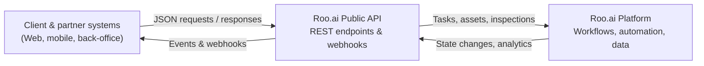

# Roo Tasks API (PoC)

Short intro to the API, auth, base URL, etc.

- Base URL: `https://api.roo.example.com`
- Auth: `Authorization: Bearer <token>`
- Main resources:
    - Tasks
    - Users

## How Roo.AI API fits into your architecture

