# How ROO.AI works: a typical API flow

This page explains how Roo.AI typically works from an API consumer's point of view.

Examples use **vehicles**, as this is the current representation of assets in the v1 API.  
Functionally, the same workflow applies to any inspectable asset.

## Conceptual diagram

```mermaid
---
config:
flowchart:
curve: basis
nodeSpacing: 40
rankSpacing: 55
theme: base
themeVariables:
fontFamily: ''
fontSize: 14px
---
flowchart LR
classDef tenant fill:#F3F6FF,stroke:#335CFF,stroke-width:1px,color:#0B1B4D;
classDef api fill:#ECFDF3,stroke:#1A7F37,stroke-width:1px,color:#052E16;
classDef core fill:#FFF7ED,stroke:#C2410C,stroke-width:1px,color:#431407;
classDef aux fill:#F8FAFC,stroke:#64748B,stroke-width:1px,color:#0F172A;

%% --- Tenant context (outside public API) ---
subgraph TENANT["Company context (tenant)"]
direction TB
company["Company (tenant)<br/>Provisioned outside public API"]:::tenant
auth["Auth context<br/>User session / API keys<br/>Company-scoped access"]:::aux
end

%% --- Public API surface (v1 naming is historical) ---
subgraph API["Public API (v1) — historical namespace"]
direction TB
userapi["User API<br/>(users, groups)"]:::api
fleets["/fleets/...<br/>Operational endpoints"]:::api
naming["Naming notes<br/>fleet ≈ автопарк / asset pool<br/>cars/car ≈ vehicle (v1)"]:::aux
end

%% --- Core operational lifecycle (conceptual) ---
subgraph CORE["Operational lifecycle (conceptual)"]
direction TB
users["Users & groups<br/>Teams, assignments, mentions"]:::core
assets["Assets (v1: cars/vehicles)<br/>Create & manage<br/>type + status + custom fields"]:::core
inspections["Inspections<br/>Templates + run inspections<br/>pause/resume/offline"]:::core
issues["Issues<br/>Findings from inspections<br/>May link to multiple inspections"]:::core
workorders["Work orders<br/>Maintenance • Repairs • Custom jobs<br/>Approvals + internal/external execution"]:::core
end

%% --- Supporting capabilities ---
subgraph SUPPORT["Supporting capabilities"]
direction TB
docs["Documents<br/>Attach to assets, users, groups,<br/>issues, work orders"]:::aux
media["Media Library<br/>Photos & videos as evidence"]:::aux
custom["Custom Attributes<br/>Extend any entity model"]:::aux
alerts["Alerts & reminders<br/>(A.R.T.) + notifications"]:::aux
supply["Warehouse & purchase orders<br/>Parts, vendors, replenishment"]:::aux
claims["Warranty & claims<br/>Compensation / warranty cases"]:::aux
reports["Reports & logs<br/>Daily logs + inspection reports<br/>BI dashboards (e.g., Metabase)"]:::aux
end

%% --- Edges: tenant -> API -> lifecycle ---
company --> auth
auth L_auth_userapi@-- "Call endpoints (company-scoped)" --> userapi
auth L_auth_fleets@-- "Call endpoints (company-scoped)" --> fleets
naming --- fleets

userapi L_userapi_users@-- "Create/manage" --> users
fleets L_fleets_assets@-- "cars/vehicles endpoints" --> assets

%% --- Core lifecycle flow ---
assets L_assets_insp@-- "Inspect asset" --> inspections
inspections L_insp_issues@-- "Create/find issues" --> issues
issues L_issues_wo@-- "Create work orders" --> workorders

%% --- Cross-cutting support connections ---
custom --- assets
custom --- inspections
custom --- issues
custom --- workorders

docs --- assets
docs --- issues
docs --- workorders
media --- inspections
media --- issues
media --- workorders

alerts -. "Notify / remind" .-> inspections
alerts -. "Notify / escalate" .-> issues
alerts -. "Notify / approvals" .-> workorders

workorders --> supply
workorders --> claims
inspections --> reports
workorders --> reports

%% --- Animations ---
L_auth_userapi@{ animation: slow }
L_auth_fleets@{ animation: slow }
L_userapi_users@{ animation: slow }
L_fleets_assets@{ animation: slow }
L_assets_insp@{ animation: slow }
L_insp_issues@{ animation: slow }
L_issues_wo@{ animation: slow }
```

---

## Step 0. Company context

Before using the public API:

- A **company (tenant)** already exists.
- API access is issued to users belonging to that company.

:::note
The public API does not create or delete companies.  
All API operations run within an existing company context.
:::

---

## Step 1. Define roles (required before users)

Before creating users, make sure the **roles** they will use already exist.

- You can assign either a **global role** or **group roles** when creating a user.
- Because of this, role configuration typically comes **before** user creation.
- Use the Roles endpoints (for example, `GET /userApi/fleets/roles`) to list available roles before creating users.

:::note
Each company has a single **fleet owner** (company owner).  
This owner role is created automatically with the company, and there can be only one.
:::

---

## Step 2. Manage users and teams

The first step is defining **who works in the system**.

Using the **User API**, you can:

- Create users.
- List and update users.
- Organize users into groups or teams.

Users and groups are later used for:
- inspections,
- work order assignments,
- approvals,
- mentions and notifications.

---

## Step 3. Register assets (vehicles in v1)

Next, you describe **what you want to manage**.

In v1, assets are represented as **vehicles** under the `/fleets/...` namespace.

Typical actions:

- Create vehicles.
- Assign asset type (for example: car, truck, equipment).
- Assign asset status (active, inactive, under maintenance).
- Add custom attributes for domain-specific data.

At this point, Roo.AI knows **which assets exist** and their basic properties.

---

## Step 4. Configure inspections

Inspections define **how asset condition is checked**.

You can configure:

- Inspection configuration (service type + questions).
- Inspection frequency (daily, weekly, periodic).
- Mandatory or optional inspections.
- Checklist structure and required inputs.

Inspection configuration ensures checks are **consistent and repeatable**.

---

## Step 5. Run inspections

Users perform inspections on assets.

During an inspection, users can:

- Answer inspection questions (the checklist).
- Add comments.
- Attach photos or videos.
- Pause, resume, or complete inspections offline.

An inspection represents a **snapshot of an asset’s condition** at a specific moment in time. Inspections represent the **execution layer** of the platform.

---

## Step 6. Detect issues

If a problem is detected:

- An **issue** is created.
- Issues can be:
    - created automatically from inspection results,
    - created manually by users.

Important characteristics:

- One issue may be linked to multiple inspections.
- Issues remain open until they are resolved.

Examples:
- “Brake pads worn”
- “Oil leak detected”
- “Damaged door”

---

## Step 7. Create work orders

Issues are resolved through **work orders**.

A work order defines:

- what needs to be done,
- who is responsible,
- how the work is approved.

Work orders can be:

- created from issues,
- created directly for planned or custom work,
- linked to one or multiple assets,
- executed by internal users or external contractors.

Work orders represent the **execution layer** of the platform.

---

## Step 8. Materials, purchasing, and warranties (optional)

If work requires parts or services, you can use supporting APIs:

- **Warehouse** — manage inventory and spare parts.
- **Purchase Orders** — order parts from vendors.
- **Vendors** — manage suppliers and contractors.
- **Warranty and Claims** — handle warranty or compensation cases.

These APIs support real operational workflows.

---

## Step 9. Attach documents and media

Throughout the workflow, you can attach additional context:

- Documents (contracts, certificates, reports).
- Media files (photos and videos).

Attachments can be linked to:
- assets,
- inspections,
- issues,
- work orders.

This ensures traceability and auditability.

---

## Step 10. Alerts, mentions, and visibility

To keep users informed:

- Configure alerts and reminders.
- Mention users or groups in comments using `@mentions`.
- Track daily logs and inspection reports.

This helps ensure issues are **noticed and acted on**.

---

## Summary: the core lifecycle

In simple terms, the typical lifecycle looks like this:

1. Define assets (vehicles).
2. Inspect assets.
3. Detect issues.
4. Execute work orders.
5. Track results and history.

Everything happens **inside a company**, and everything is accessible via API once the company exists.

---

## Why this matters for API users

Using the Roo.AI API, you can:

- Integrate asset inspections into your own systems.
- Automate issue tracking and maintenance workflows.
- Build custom dashboards and reports.
- Apply the same workflow beyond vehicles.

Vehicles are just the starting point — the API flow is asset-based by design.
