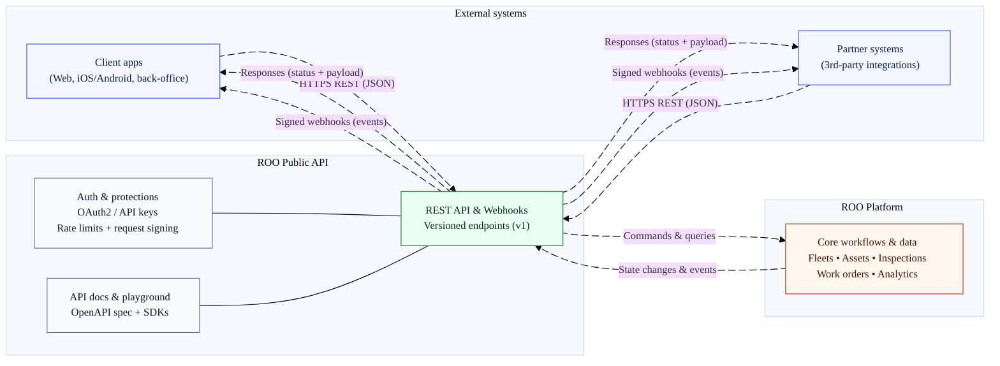

# ROO.AI Platform API

The **ROO Platform API** provides programmatic access to the platform for **external integrations**. It enables partners and third-party systems to securely interact with **core platform resources**, including users, companies, fleets, inspections, maintenance workflows, and operational data.

The API is organized into **logical, domain-based sections** and exposes **stable, well-defined REST endpoints** intended for integration scenarios. **Authentication is handled using bearer tokens**, and most endpoints support **interactive exploration and testing** through the built-in *Try it out* functionality.




## Authentication

The API uses **HTTP bearer authentication** with **JSON Web Tokens (JWT)**.  
Include the access token in the `Authorization` header of each request.

**Example**

```http
Authorization: Bearer YOUR_ACCESS_TOKEN
```

The following table summarizes the authentication scheme used by the API:

| Property                     | Value  |
|------------------------------|--------|
| Security scheme type         | HTTP   |
| Authorization scheme         | Bearer |
| Bearer token format          | JWT    |

## Base URL

Use the following base URL for all API requests:

```text
https://lp.driveroo.com
```